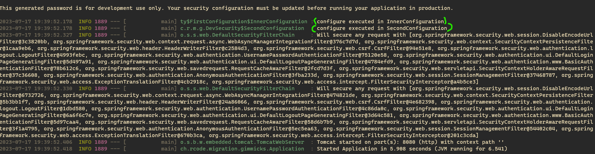
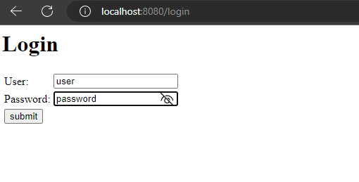
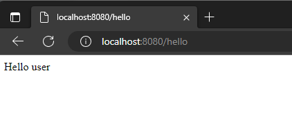

The configuration using the old style `WebSecurityConfigurerAdapter` configuration classes, before Spring Security 5.7/5.8 migration is following:

[`DevSecurity`](src/main/java/ch/rcode/migration/gimmicks/DevSecurity.java) main configuration class with two nested configuration classes:
1. `FirstConfiguration` configuration class which contains the `InnerConfiguration` configuration class, extending `WebSecurityConfigurerAdapter` and marked as with the `@Order(Ordered.HIGHEST_PRECEDENCE)` annotation
2. `SecondConfiguration` configuration class which extends the `WebSecurityConfigurerAdapter` adapter configuration class

When running the order of the applied configuration is following:

The [`migrated`](https://github.com/rawfg/spring-migration-gimmicks/tree/migrated/) branch contains the same `DevSecurity` class after the Spring Security migration: 
- The `WebSecurityConfigurerAdapter` adapters were removed
- The `SecurityFilterChain` beans were provided instead

I updated the security rules to present the problem and added some more flow. 
There is a login endpoint and a login page configuration as well as one in-memory user.
When I navigate to the http://localhost:8080/hello I'm redirected to the http://localhost:8080/login:

And after providing the user credentials  (**username**: _user_, **password**: _password_) I see:

And **this is an expected behavior**.
