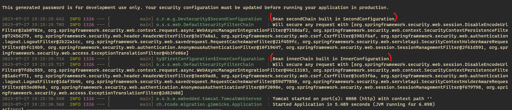
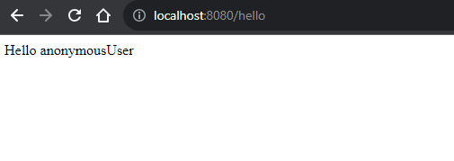

When migration was done the new `SecurityFilterChain` bean configuration, the execution of the security filter chains occurred in the _reverse_ order:

1. `secondChain` was executed first
2. `innerChain` of the `FirstConfiguration` configuration class, despite having `@Order(Ordered.HIGHEST_PRECEDENCE)` was executed later

It seems to affect the security flow, when I access the http://localhost:8080/hello I see:

